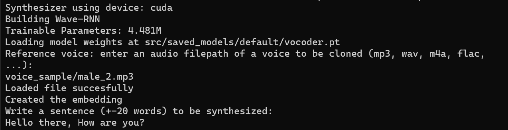

# Voice Cloning Assignment


## **INTRODUCTION**
The work have utilised the pretrained model SV2TTS proposed in the paper "[Transfer Learning from Speaker Verification to
Multispeaker Text-To-Speech Synthesis](https://arxiv.org/pdf/1806.04558.pdf)". Basic system consists of three components namely
1. <u>Speaker Encoder</u> -  Its purpose is to generate a fixed-dimensional embedding vector by analyzing a few seconds of reference speech from a target speaker.
2. <u>Sequence-to-Sequence Synthesis Network</u> - this network generates a mel spectrogram from input text with reference to target speakers embeddings.
3. <u>Auto-regressive Vocoder Network</u> - Converts the mel spectogram into waveform samples.

The model can effectively transfer the knowledge of speaker variability learned by the discriminatively-trained speaker encoder to the multi-speaker text-to-speech task. As a result, it is capable of generating natural-sounding speech from speakers who were not seen during the training phase.

## **REQUIREMENTS**

 - Need to install [ffmpeg](https://ffmpeg.org/download.html#get-packages) for reading the audio files
 - Install [PyTroch](https://pytorch.org/get-started/locally/). Select the version which support for GPU (GPU is recommended), else CPU based also be used for the implementation.
 - Install the remaining dependencies given in the `requirement.txt` file

## **EXECUTING THE MODEL**

1. Run the command 
`python implementation.py`


2. As soon as the command is executed, Pretrained model will be automatically downloaded from drive and saved in`\src\saved_models` directory.

3. Specify the relate directory for the voice sample to be clones


4. Enter a text input for synthesis


5. Give in output file and systhesised voice will be available in the output folder


Note: The pretrained model will automatically be downloaded. It wont be necessary to download manually. Case if the pretrained is downloaded manually, save the models in the following directory

```
src/saved_models/default/encoder.pt
src/saved_models/default/synthesizer.pt
src/saved_models/default/vocoder.pt
```

Links for the pretrained models, [encoder](https://drive.google.com/file/d/1q8mEGwCkFy23KZsinbuvdKAQLqNKbYf1/view?usp=sharing), [synthesizer](https://drive.google.com/file/d/1EqFMIbvxffxtjiVrtykroF6_mUh-5Z3s/view?usp=sharing), [vocoder](https://drive.google.com/file/d/1cf2NO6FtI0jDuy8AV3Xgn6leO6dHjIgu/view?usp=sharing)

Implementrate is compiled into a demonstration video.You can refer the video [here](https://drive.google.com/file/d/1MquvELvP8pFmmXTbgIfPbfZ2Vm2oCoCe/view?usp=sharing).

## **SOURCE CODE**

The code is organized in `src` folder with directory structure. Each component model architecture is defined in following files
```
├── encoder
|   └── model.py
├── synthesizer
|    └── models
|        └── tacotron.py
├── vocoder
|    └── models
|        ├── deepmind_version.py
|        └── fatchord_version.py
└── utils

```

## **TEST SAMPLES**

The firectory `voice_samples` contains a list of four different accents voices.

```
├── female_1
├── male_1
├── male_2
└── male_3
```

We use these accent to synthesize a cloned voice to utter the following sentences

```Hello there, how are you? ```

The respective synthesized output are saved in `output` directory.

